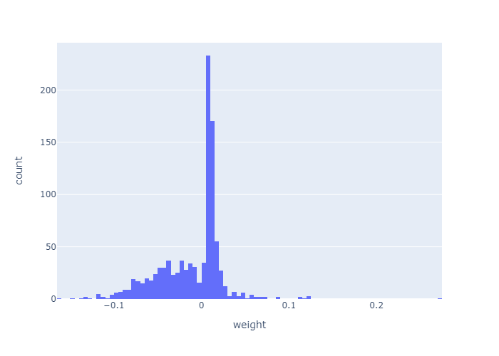
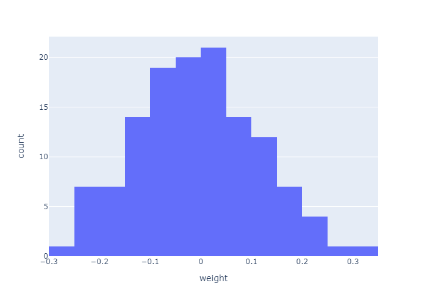

## TFWDA

[![Author][contributors-shield]][contributors-url]
[![MIT+ License][license-shield]][license-url]
![Version][version-shield]

### Goal
Tensorflow Weight Distribution Analyser (TFWDA) is a library which extracts the weights out of neural network models and will plot all the distributions and will also compute metrics and statistics of these weights and stores these into a MongoDB database. 

### How to use it
1. The unit test ``model_store_utest.py`` shows how to use the library (it is very simple to use)
2. Dependencies are in ``requirements.txt``

### Results

  <h4>DenseNet121_bn_moving_mean_0_(1024,)_float32.png</h4>
  
  <h4>DenseNet121_conv2_block1_1_bn_beta_0_(128,)_float32.png</h4>
  

These are example plots from the DenseNet121 architecture.

The upper image shows a document which gets inserted with all the information about the architecture and all the extracted metrics in a MongoDB database. The lower image shows an example of the medians which were extracted out of the distributions and stored in a flat format as an array in the database.
  
[contributors-url]: https://github.com/RaphSku
[license-url]: https://github.com/RaphSku/TFWDA/blob/main/LICENSE

[contributors-shield]: https://img.shields.io/badge/Author-RaphSku-orange?style=plastic&labelColor=black
[license-shield]: https://img.shields.io/badge/License-MIT+-informational?style=plastic&labelColor=black
[version-shield]: https://img.shields.io/badge/Version-1.0-red?style=plastic&labelColor=black
